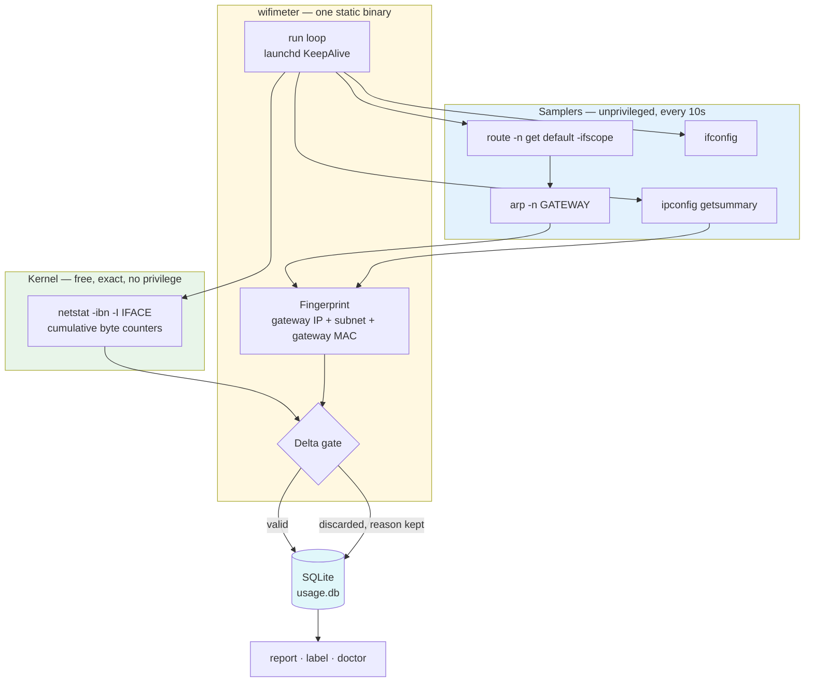

# wifimeter

Bandwidth accounting per Wi-Fi network, for macOS. One static binary that asks
for nothing: no Location Services, no sudo, no packet capture.

Every commercial tool that shows per-network usage asks for Location Services,
and they have no choice in the matter. macOS has withheld the SSID from
unentitled processes since 14.4, and a `launchd` agent can never get it because
there is no window to present the prompt from. So `wifimeter` identifies the
network by its gateway instead: IP, subnet mask, and gateway MAC.

## Install

### Download a binary

Two commands, whatever your Mac. They pick the right artifact and save it as
`~/bin/wifimeter`:

```sh
mkdir -p ~/bin
curl -L -o ~/bin/wifimeter \
  "https://github.com/mr687/wifimeter/releases/latest/download/wifimeter-darwin-$(uname -m)"
chmod +x ~/bin/wifimeter
xattr -d com.apple.quarantine ~/bin/wifimeter
~/bin/wifimeter doctor
```

`uname -m` prints `arm64` on Apple Silicon and `x86_64` on Intel, which matches
the artifact names. The `xattr` line removes the flag macOS sets on anything
downloaded; without it Gatekeeper refuses to run the binary, since these are
not signed with a Developer ID.

Add `~/bin` to your `PATH` if it is not there already, then `wifimeter` works
from anywhere. On the default zsh shell:

```sh
echo 'export PATH="$HOME/bin:$PATH"' >> ~/.zshrc
```

Want to check what you downloaded? Each release ships a `SHA256SUMS` next to
the binaries.

### Build from source

```sh
git clone https://github.com/mr687/wifimeter
cd wifimeter
make build      # -> ~/bin/wifimeter
make install    # build, then write the launchd agent and load it
```

## Use

```sh
wifimeter doctor                 # verify every read works, no sudo
wifimeter report --days 7        # per-network totals
wifimeter label "Phone hotspot"  # name the network you are on
wifimeter report
```

```
Network                       Today                7 days              All time
─────────────  ────────────────────  ────────────────────  ────────────────────
Home               ↓ 39 GB ↑ 2.9 GB      ↓ 196 GB ↑ 13 GB      ↓ 1.0 TB ↑ 82 GB
Phone hotspot     ↓ 1.7 GB ↑ 200 MB     ↓ 5.8 GB ↑ 744 MB     ↓ 5.8 GB ↑ 744 MB
─────────────  ────────────────────  ────────────────────  ────────────────────
Total              ↓ 41 GB ↑ 3.1 GB      ↓ 201 GB ↑ 14 GB      ↓ 1.0 TB ↑ 83 GB
```

`doctor` also reports what is in the database: sample count, discard rate, the
oldest and newest samples, database size, and whether the agent is loaded. It is
the thing to run first when a number looks wrong.

To stop collecting:

```sh
wifimeter uninstall           # remove agent and binary, keep the database
wifimeter uninstall --wipe    # also delete the database
```

To see the shape of usage over time rather than a total:

```sh
wifimeter report --daily --label "Phone hotspot" # or --fp KEY, or neither for all networks
wifimeter report --daily --days 30
```

Days are bucketed by local time, with quiet days kept as zeroes, followed by the
peak day, the median, and the busiest seven-day stretch. A total hides the week
that ran several times higher, and that is the week that exhausts an allowance.

To check which build you have:

```sh
wifimeter version     # wifimeter v1.0.3 (darwin/arm64)
```

## Use cases

- **Sizing a hotspot plan.** Tethering away from Wi-Fi and unsure how much
  quota to buy? Run it for a normal week; the 7-day column is your answer.
- **Checking a metered bill.** Counters are taken at the network layer, the
  same place your carrier bills from, so a mismatch is worth a phone call.
- **Finding where the data went.** Per-network totals narrow a vanished
  allowance down to the network you were on.
- **Shared household links.** Totals say whether the plan fits everyone using
  it. Two SSIDs behind one gateway do count together.
- **Travel SIM and eSIM.** Same problem, smaller scale: one number per network.

It will not name the app that used the data, only the network that carried it.

## How it works



The SSID never appears in that diagram, which is the point. It cannot be read
without Location Services, so the gateway stands in for it.

| Read | Source | Privilege |
|---|---|---|
| Byte counters | `netstat -ibn -I <iface>` | none |
| Link status, netmask | `ifconfig <iface>` | none |
| Wi-Fi gateway | `route -n get default -ifscope <iface>` | none |
| Gateway MAC | `arp -n <gateway>` | none |
| DHCP vendor class | `ipconfig getsummary <iface>` | none |

The `-ifscope` flag is what keeps a VPN from being metered in place of the
network. Any active tunnel moves the system default route onto a `utun`
interface, and only the scoped lookup still returns the Wi-Fi gateway you are
actually on.

Only the physical Wi-Fi interface gets read. Tunnel traffic is encapsulated
inside its frames, so adding `utun*` would count it twice. The `awdl0` and
`llw0` interfaces share the radio for AirDrop and carry nothing that counts as
network usage.

`tcpdump`, CoreWLAN, `system_profiler`, and Network Extension filters are all
unused.

Samples land in SQLite every 10 seconds. One gets discarded rather than guessed
at when the link is down, the gateway is unknown, the network changed, the
counters moved backwards, or more than 50 seconds passed since the previous
sample. Losing a sample costs ten seconds. Accepting a bogus one would put
gigabytes into a day's totals that nobody transferred.

## Limits

- **No true SSID.** Two SSIDs behind one gateway collapse into a single
  fingerprint, because they share the gateway MAC. That includes the 2.4 and
  5 GHz bands of the same router, and guest networks.
- **No per-app breakdown.** That needs `nettop` or a Network Extension filter.
- **10s granularity.** A network joined and left inside one interval can be
  missed entirely.
- **Sleep detection is a heuristic**, inferred from the gap between samples.
- **macOS only.** Each command above is BSD-flavored. The code compiles
  anywhere Go runs; the tool does not work anywhere else.

## Privacy

Each network's row holds its gateway IP, subnet, gateway MAC, DHCP vendor
class, and timestamped byte deltas. Gateway MACs can pin down places you have
been, so treat `usage.db` as sensitive. It stays at
`~/Library/Application Support/WifiMeter/usage.db`.

## Development

```sh
make check      # gofmt, vet, test
make test
```

Golden tests over captured command output cover the parsing, in `testdata/`.
After an intentional change, `go test -update` rewrites the goldens.

The build runs with `CGO_ENABLED=0` and links only `libSystem` and
`libresolv`, so the binary carries no Homebrew dependency. SQLite comes from
`modernc.org/sqlite`, which is pure Go.

## License

MIT
